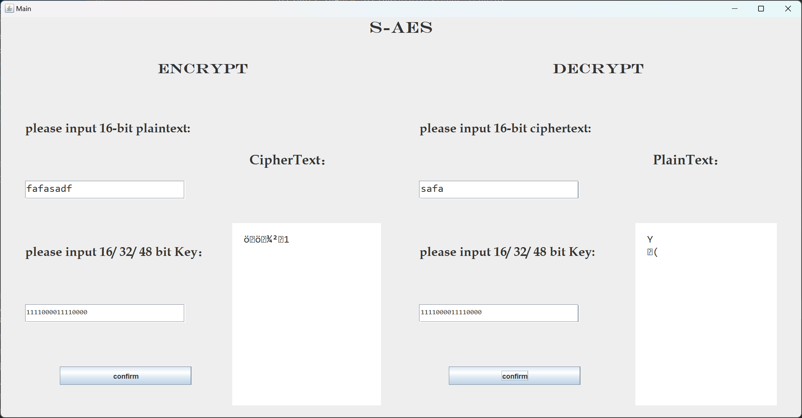
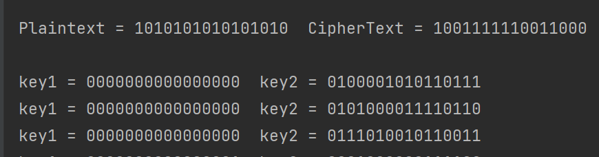

# Introduction
In this project, we designed a structure to use S-AES encryption which holds 16/ 32/ 48 -bit group length and 16-bit key length.

# Structure - How it works?
## It contains 4 parts.

- keyScheduler.java: keyScheduler class receives a 16-bit initial key string and calculates cipher keys.
- AES.java: This class accepts clear text, and identifiers that identify encryption or decryption, and performs operations.
- Main.java: Main class. Scheduling tests and the running of various UI modules, monitoring user operations. 
  - This section gets the information entered by the user and controls the invocation of the keyScheduler and the AES encryption decryptor in terms of the number of bits or the string type of the information.  
  - Meanwhile, this part can be controlled to invoke middle encounter attacks, and CBC encryption
- Main.form: a format sheet
- GF2_4: This is a call interface to a multiplication operation on the Galois domain for the column obfuscation module in the AES cryptosystem
- [Image folder] contains images of AES.md

  

# Examination

## **Level 1: Basic test**

Encrypt：input 16bit plaintext and 16bit key, output is 16bit ciphertext.
Decrypt：input 16bit ciphertext and 16bit key, output is 16bit plaintext.

    

## **Level 2: Cross-testing**

Cross-testing with other groups - when inputs are the same outputs are the same and the test is successful.

## Level 3: Extended functionality
 Considering the extension to utility, the data input of the encryption algorithm can be an ASII-encoded string (grouped in 1 Byte), and correspondingly the output can be an ACII string. Since the ASCII code range is 0~253, and the encryption may be negative, there is a certain possibility of outputting garbled code.
 Encryption: input n-byte plaintext and 16bit key, output is n-byte ciphertext.
 Decryption: input n-byte ciphertext and 16-byte key, output is n-byte plaintext.

    

## Level 4: Multiple Encryption
### 3.4.1 Double encryption: 
the packet length remains 16 bits but the key length is 32 bits.
 

    

### 3.4.2 Mid-encounter attack

    

    

### 3.4.3 Triple Encryption: pattern of 48 bits (K1+K2+K3)
 

    

 

## Level 5: Mode of operation
- Encrypts longer plaintext messages based on the S-AES algorithm using Ciphered Chaining of Packets (CBC) mode.
- When the main function is called, the Random function generates a random vector IV, which does not change until the end of the program run.
- It can be called through the MainCBC interface.
  
Encryption: 1.Generate IV vector when the Main function is started 2.Set the plaintext length to 3*16-bit = 48-bit 3.Enter the 16-bit key and 48-bit plaintext. 4.Get the result of CBC encryption based on S-AES.
 

    

  
Decryption:  
Same steps as encryption.  Input the ciphertext obtained after encryption of the previous text, and the decryption result is the same as the original plaintext. 
 

    

## Interfaces

| filename          | interface function name                   | input parameters                    | output parameters    |describtion          |
|-------------------|-------------------------------------------|-------------------------------------|----------------------|---------|
| keyScheduler.java | `keyScheduler(String a)`                  | `String a`                          | void（构造函数）           |
| keyScheduler.java | `getKeys()`                               | null                               | `String[]`（密钥串）      |
| keyScheduler.java | `two_bit_binaryToDec(String str)`         | `String str`                        | `int` （转换后的整数）       |
| AES.java          | `AES(String Text, String[] keyT, int n)`  | `String Text, String[] keyT, int n` | void（构造函数）           |
| AES.java          | `getResultCipher()`                       | null                               | `String`（加密结果的密文）    |
| AES.java          | `getResultPlain()`                        | null                               | `String`（解密结果的明文）    |

| filename| interface function name                           | input parameters              | output parameters | describtion          |
|-------------------|-------------------------------------------|-------------------------------------|----------------------|---------|
| Main   | `Main()`                                          | null                         | void      | Mid-encounter attack |
| Main   | `meet_in_the_middle(String plain, String cipher)` | `String plain, String cipher` | void      | formatCheck          |
| Main   | `formatCheck(String str)`                         | `String str`                  | `boolean` |                      |
| Main   | `formatTransform(char c)`                         | `char c`                      | `String`  |                      |
| Main   | `stringToChar(String str)`                        | `String str`                  | `String`  |                      |
| Main   | `CBCScheduler()`                                  | void                          | void      | CBC Encryption Sche  |
| Main   | `CBC(int n)`                                      | `int n`                       | void      |                      |
| Main   | `xor(String str, String key)`                     | `String str, String key`      | `String`  |                      |
| Main   | `int2_16bitString(int n)`                         | `int n`                       | `String`  |                      |

## Users' Manual
1. ENCRYPT

    1. enter the 16-bit length of the original text to be encrypted in "please input ciphertext". 1. enter the 10-bit key in "please input 10-bit Key";

    1. enter the 16/32/48-bit key in "please input 16/32/48 bit Key". 1. click "confirm" and then enter the key in "Confirm";

    1. After clicking "confirm", the generated cipher text appears in "CipherText".

2. DECRYPT

    1. Enter the 26-bit ciphertext in the "please input ciphertext" field. 2;

    1. enter a 16/32/48-bit key in "please input 16/32/48 bit Key". 1. click "Confirm";

    1. Click "confirm" and the generated original text appears in "PlainText".

    

### author: Yiming Yan, Xiangyu Ran. CQU.